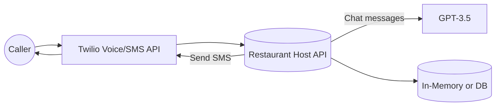

# Restaurant AI Host: Sofia

<p align="center">
  
</p>

**Sofia** is an AI-powered restaurant hostess that can:
- **Handle reservations** based on an in-memory seat availability schedule
- **Take customer orders** and finalize them
- **Send SMS confirmations** using Twilio  
- **Log conversations** for record-keeping or analytics

All powered by **FastAPI**, **OpenAI (GPT-3.5)**, and **Twilio** for voice interactions.

---

## Table of Contents
1. [Features](#features)  
2. [Architecture](#architecture)  
3. [Demo Flow](#demo-flow)  
4. [Installation & Setup](#installation--setup)  
5. [Usage](#usage)  
6. [Screenshots](#screenshots)  
7. [Project Structure](#project-structure)  
8. [License](#license)

---

## Features

- **Multi-Turn Voice Interaction**: Users call a Twilio number to talk to Sofia.  
- **Reservations**: Sofia checks an internal schedule, updates seat counts, and sends SMS confirmations.  
- **Orders**: Users can add menu items to a takeout order until they say “done,” at which point the system finalizes the order.  
- **Conversation Logs**: All user and AI turns are logged in `conversation_logs.txt`.  
- **Menu**: References a real(ish) menu of appetizers, mains, desserts, and drinks, ensuring more authentic AI responses.

---

## Architecture



1. **Caller dials** the Twilio number.  
2. **Twilio** directs the call to your **FastAPI** endpoints.  
3. **FastAPI** interprets caller speech, logs it, consults **OpenAI** for responses, and checks **DataStores** for reservations or menu data.  
4. **FastAPI** sends **TwiML** instructions back to Twilio. Twilio plays them to the caller.  
5. **SMS confirmations** are sent for successful reservations.

---

## Demo Flow

1. **User calls** the Twilio number.  
2. **Greets Sofia**: “I want to make a reservation.”  
3. **Reservation**: Sofia asks for date/time. If seats are available, the system updates and sends an SMS.  
4. **Another user**: “I’d like to order a Margherita Pizza.”  
5. **Ordering**: Sofia logs items until the user says “done.” Then it prints an “OWNER NOTIFICATION” in the logs.  
6. **Logs**: The conversation is stored in `conversation_logs.txt`.

---

## Installation & Setup

1. **Clone** this repo:
   ```bash
   git clone https://github.com/<YourUsername>/restaurant-ai-host.git
   cd restaurant-ai-host
   ```

2. **Create** a virtual environment

	```bash
	python -m venv venv
	source venv/bin/activate  # or venv\Scripts\activate on Windows
	pip install -r requirements.txt
	```
	
3. **Create** environment variables
	```bash
	OPENAI_API_KEY=sk-...
	TWILIO_ACCOUNT_SID=AC...
	TWILIO_AUTH_TOKEN=...
	TWILIO_PHONE_NUMBER=+1234567890
	PORT=YourPort
	```
4. **Expose with Ngrok** so Twilio can reach
	```bash
	ngrok http yourPort
	```
	
5. **Configure Twillo Webhook** 
	In the Twilio console, set the Voice webhook to:
	```bash
	https://<your-ngrok-url>/incoming-call
	```

## Usage

1. **Call** your Twilio number.
2. **Speak** a request: “I’d like to order,” or “I want to reserve a table.”
3. **Follow** Sofia’s prompts to confirm seat availability or add menu items.
4. **Finish**: For a reservation, you receive an SMS confirmation; for an order, you see “OWNER NOTIFICATION” in the server logs.


## Project Structure

```bash
restaurant-ai-host/
├── main.py               # Main FastAPI code
├── requirements.txt      # Dependencies
├── conversation_logs.txt # Logs of user-AI interactions
├── .env.example          # Sample environment variables
└── README.md             # This file
```


## License

This project is licensed under the [MIT License](LICENSE). See the LICENSE file for details.

## Contact

For any inquiries or feedback, please contact [Saurav Anand](https://github.com/sauravanand542).
